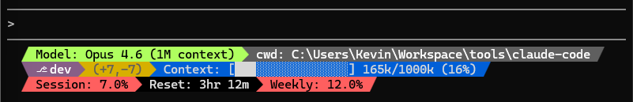

# KRA Plugins

[](LICENSE)

*Opinionated Claude Code configuration, inspired by Anthropic best practices.*

**KRA** (Kevin RAmarozatovo) — my personal [Claude Code](https://code.claude.com) plugin collection. This repository contains the skills, hooks, and defaults I use daily across all my projects.

## Install

```bash
# Add the marketplace
/plugin marketplace add Kevin-rm/claude-code

# Install the plugins you want
/plugin install <plugin-name>@kra-plugins

# Activate
/reload-plugins
```

## Presets

The `presets/` directory contains user-scope configuration files meant to be installed into `~/.claude/`.

Use the setup script to install them:

```bash
./presets/setup.sh
```

If the target file already exists, the script will offer to **merge** (your settings win on conflicts), **overwrite**, or **skip**. A timestamped backup is created before any destructive operation.

Available options:

| Flag                | Description                                                                |
|---------------------|----------------------------------------------------------------------------|
| `--dry-run`         | Show what would be done without making changes                             |
| `--force-overwrite` | Overwrite existing files without prompting                                 |
| `--non-interactive` | Skip prompts; existing files are left untouched unless `--force-overwrite` |

Merge requires [jq](https://jqlang.github.io/jq/) — the script will offer to install it if missing. On Windows (winget), you may need to **restart your terminal** after installing jq for it to be available in PATH.

### Statusline

The presets ship with a preconfigured status bar that displays model info, git status, context usage, and session metrics at a glance. The layout was generated with [ccstatusline](https://github.com/sirmalloc/ccstatusline) and can be customized further via its interactive TUI.



## Development

```bash
# Clone the repo
git clone https://github.com/Kevin-rm/claude-code.git
cd claude-code

# Install dependencies
bun install

# Test a plugin locally
claude --plugin-dir ./plugins/<plugin-name>
```

Commits follow [Conventional Commits](https://www.conventionalcommits.org/), enforced with commitlint and husky.

## Credits

The `skill-creator` skill is derived from [anthropics/skills](https://github.com/anthropics/skills). See its [NOTICE](plugins/base/skills/skill-creator/NOTICE) for details.
